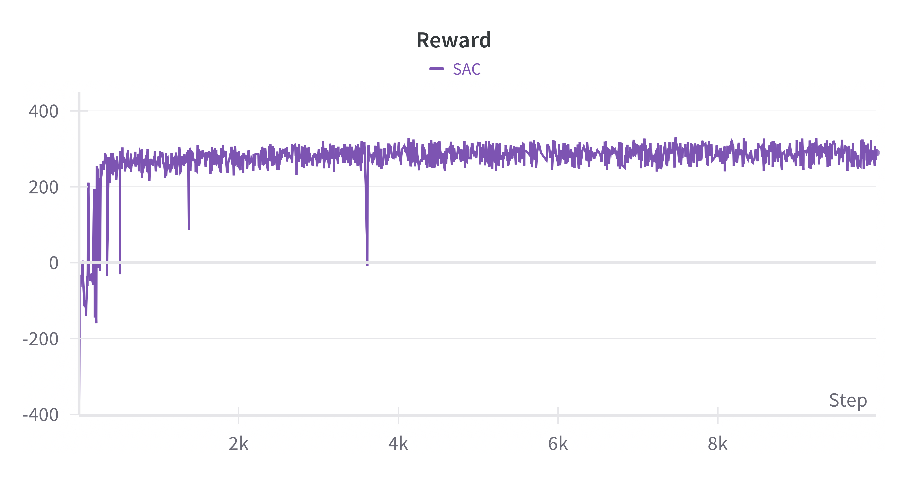
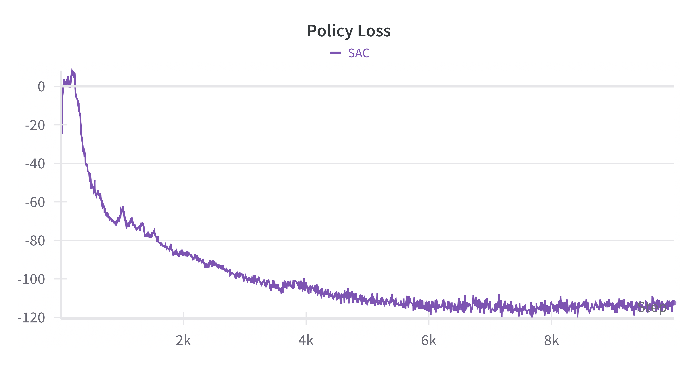
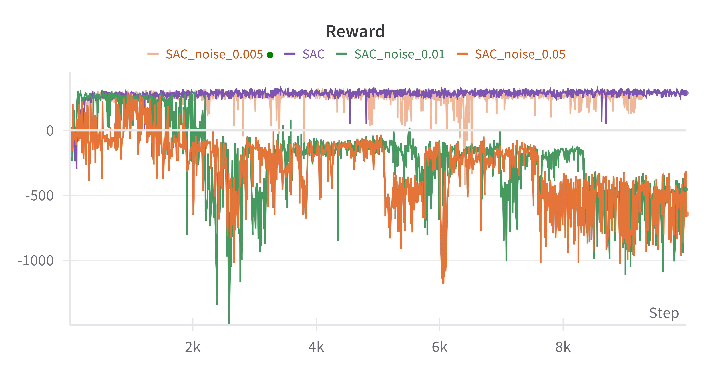
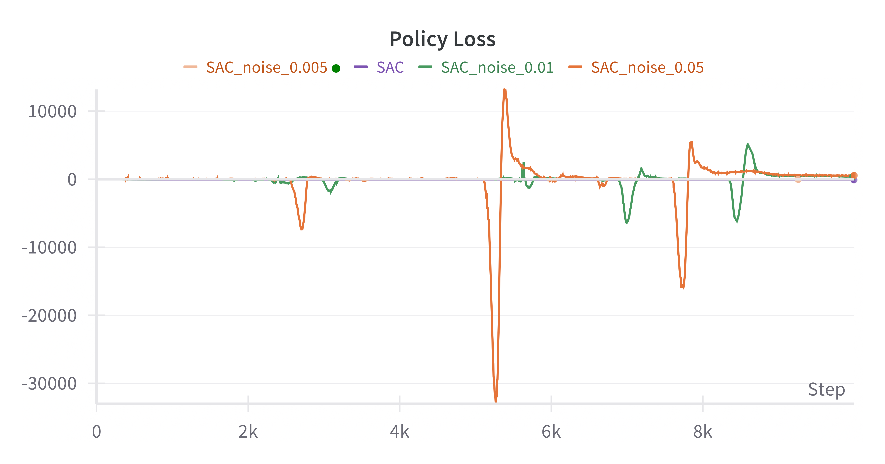
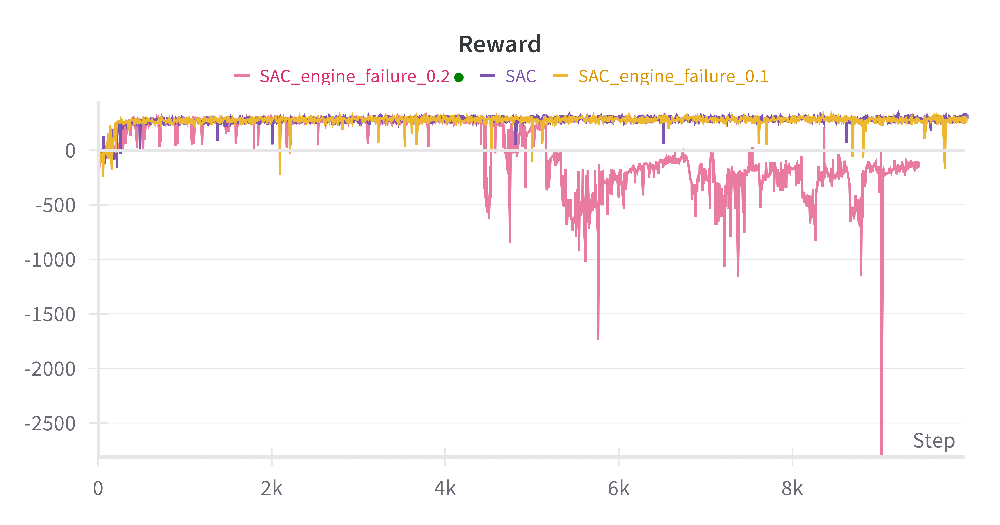
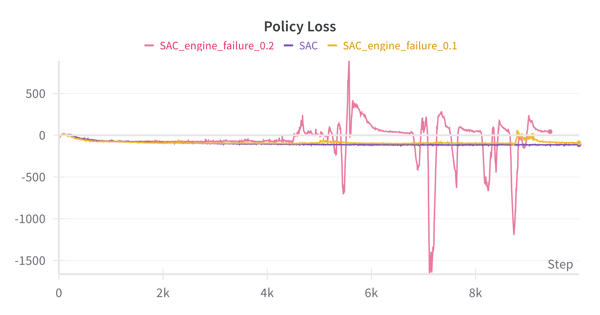

# SAC-Discrete - COMP3340 Group Project

## Overview

This GitHub repository contains the work for the COMP3340 course's group project. This repo focuses on the implementation of Discrete Soft Actor-Critic algorithm.

### Installation

```
sudo apt install -y python3-opengl xvfb swig
pip install -r requirements.txt
```

### Run

Below is the command to run the algorithm. The trainings are logged with wandb.ai.

```
python SAC.py
```

##### Edit configuration

```
python SAC.py [-e episodes] [-n noise] [-ef engine_failure] [-bs buffer_size] [-s seed] [-se save_every] [-sn save_name] [-bs batch_size]
```

Description:

- `-e` or `--episodes` (int): Total number of episodes to train for (default: 1000)
- `-n` or `--noise` (float): Sigma value for the Gaussian distribution of noisy observations (default: None)
- -ef or --engine_failure (float): Probability of engine failure (default: None)
- `-bs` or `--bufer_size` (int): Size of the replay buffer (default: 100000)
- `-s` or `--seed` (int): Random Seed (default: 1)
- `-se` or `--save_every` (int): Save the model every n episodes (default: 100)
- `-sn` or `--save_name` (str): The name of the saved model. (defualt "SAC")
- `-bs` or `--batch_size` (int): Size of the training batch (default: 256)

### Results

##### Midterm report results (original model)


#### Introducing Uncertainty

##### Original model



##### Introduce Noisy Observation:





##### Introduce Random Engine Failure




